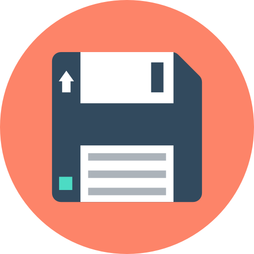

<h1 align="center">ASA</h1>

<i>Automatic Security Access</i>

  

## 📊 Sobre nossa empresa

Nós somos da empresa ASA, sigla de Automatic Security Access, que traduzindo significa Acesso Seguro Automático.

O que fazemos? Bom, nossa empresa se concentra em um determinado público e um público alvo específico. Nosso produto tem como nicho a área de tecnologia e aplicativo, concentrando-se na área residencial, nos focando em casas, dando mais praticidade no cotidiano de nossos clientes.

## ✔️ Objetivos
- Aplicativo Bluetooth para abrir o portão.
- Site comercial para promover o produto.
- Maquete do portão com Arduino.

## 👤 Integrantes
Coordenadores do projeto:
- Matheus Noronha
- Gabriela Monden
- Larissa Vasconcelos
- Luccas Alberto

## 📱 Redes Sociais
- Instagram: https://www.instagram.com/empresa_asa/
- Facebook: https://www.facebook.com/profile.php?id=100069575013947&locale=pt_BR

## 📋 Manual de Instruções

Clique no ícone abaixo para acessar o nosso Manual de instruções do Portão Automático:

